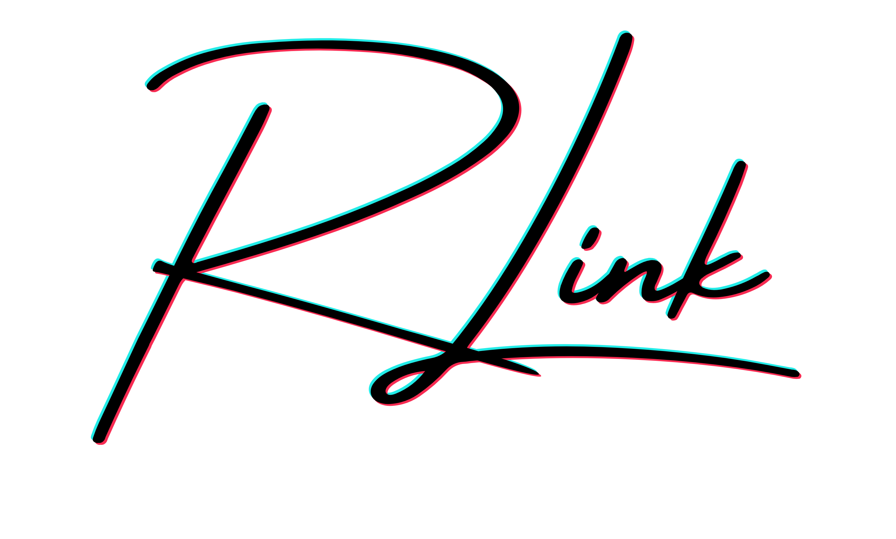

<picture>
  <source media="(prefers-color-scheme: dark)" srcset="./img/rlink-dark.png">
  
</picture>

# RLink

RLink is a codebase for reinforcement learning research.
It is not a framework, but a collection of tools and resources for conducting research in the field.
RLink uses several tools including:

- [black](https://black.readthedocs.io/en/stable/) for code formatting
- [ruff](https://docs.astral.sh/ruff/) for code linting
- [PyTorch](https://pytorch.org/) as the deep learning library
- [Gymnasium](https://gymnasium.farama.org/) as the reinforcement learning environment API
- [tyro](https://brentyi.github.io/tyro/) for configuration
- [WandB](https://wandb.ai/site) for experiment tracking and monitoring
- [TensorBoard](https://www.tensorflow.org/tensorboard) for experiment tracking and monitoring
- [pytest](https://docs.pytest.org/en/stable/) for testing

## Get Started

See [install.md](./install.md)

## Code Quality

- **No Warnings:** The code is carefully written to make sure no warnings appear when running it. This focus on quality helps keep the code clean and free from problems caused by ignored warnings.
- **Type Hinting:** Every function and method is clearly annotated with type hints for both inputs and outputs. This makes the code easier to understand and helps prevent mistakes related to incorrect types, making the code more reliable and easier to maintain.
